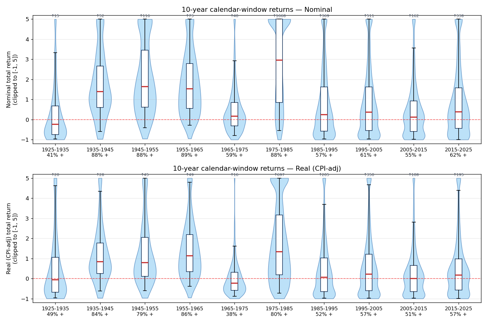
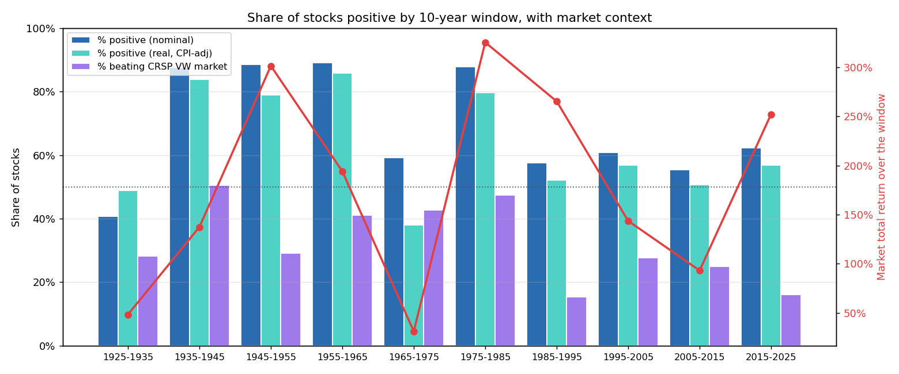
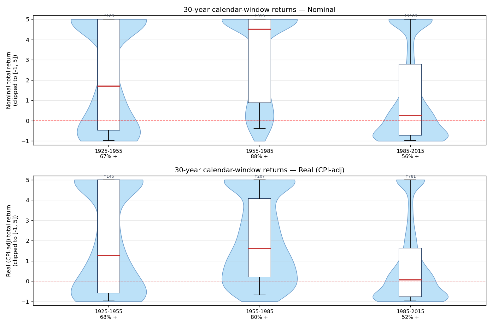
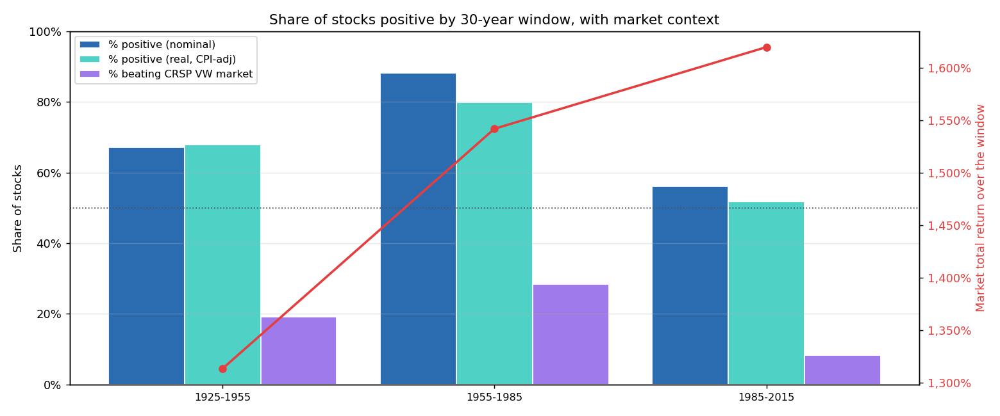

# Long-run return distributions of US-listed stocks

*CRSP monthly, 31,565 common stocks, Dec 1925 – Dec 2025*

*Calendar-window methodology: every 10-year window (1925-35, 1935-45, … 2015-25) and every 30-year window (1925-55, 1955-85, 1985-2015) is analyzed on its own cohort.*

---

## TL;DR

- The share of stocks producing a positive return is **deeply period-dependent**. Across the ten non-overlapping decades since 1925, % positive (nominal) ranges from **40.7 %** (1925-1935, the Depression decade) to **89.0 %** (1955-1965, mid-century boom).
- In real (CPI-adjusted) terms, the worst decade is **1965-1975** — just **38.0 %** of stocks produced a positive real return as stagflation eroded nominal gains. The best is again 1955-1965 (**85.8 %**).
- The market return and the share of individual stocks beating it **diverge sharply** in the last two bull decades: in 1985-1995 the market returned **+265 %** but only **15.4 %** of stocks beat it; in 2015-2025 the market returned **+252 %** but only **16.2 %** of stocks beat it. Concentration in mega-caps has intensified.
- Over **30-year windows**, 67–88 % of stocks have produced a positive nominal return; % positive fell from **88 %** in 1955-1985 to **56 %** in 1985-2015.
- Over **each stock's entire listed life** (Q3), only **48.1 %** produced a positive nominal return and **41.3 %** a positive real return.

---

## 1. Data & universe

- **Source:** CRSP Monthly Stock File (`data/data.csv`, 5,307,138 rows, 40,499 raw PERMNOs).
- **CPI:** CPI-U, All Urban Consumers, not seasonally adjusted, BLS monthly 1925-2025. Cached at `data/cpi.csv`. Full-span cumulative inflation **18.1×** (2.94 % / yr).
- **Universe:** `SecurityType == 'EQTY' AND IssuerType != 'REIT'` — 31,565 common stocks (22,623 CORP + 8,867 ACOR, including 1,377 ADRs). Excludes closed-end funds & ETFs (`FUND`), derivatives (`DERV`), and REITs.
- **Span:** 1925-12 – 2025-12 (1,201 months).

## 2. Methodology — calendar-aligned windows

Per CLAUDE.md the analysis must be survivorship-bias-free: every stock that ever listed is retained, with delisting handled by terminating the return stream at the delisting month (CRSP embeds the delisting return in `MthRet` when `MthRetFlg == 'DE'`).

**For each calendar window `(T, T+N]`:**
1. **Cohort** = every common stock with a row at month `T` (listed at end of month T, i.e. available to buy). Stocks that IPO'd after T are not in this window's cohort — they will be in a later window's cohort if they survive to it.
2. **Window return** = `∏(1 + MthRet_t) − 1` compounded over months strictly after T and up to T+N, truncated at the stock's last listed month if it delists before T+N.
3. If a stock delists during the window, its return is whatever it realized before delisting — **partial windows are kept, not dropped**.

**Windows:**

| Horizon | Windows | Months each |
| --- | --- | --- |
| 10-year | 1925-12 → 1935-12, 1935-12 → 1945-12, …, 2015-12 → 2025-12 (10 decades) | 120 |
| 30-year | 1925-12 → 1955-12, 1955-12 → 1985-12, 1985-12 → 2015-12 (3 eras) | 360 |
| Full-life | per-stock: first listed month → last listed month | variable |

**Real returns:** monthly real return `(1 + MthRet) / (1 + π) − 1`, where `π = CPI_t / CPI_{t-1} − 1`, then compounded exactly like nominal.

**Benchmark:**
- **CRSP value-weighted total return (`vwretd`)** — with dividends; apples-to-apples with `MthRet`.
- **S&P 500 price index (`sprtrn`)** — no dividends; reported for reference.
- Both are compounded over the **same calendar months** as the window, and `% beating` is the fraction of the window's cohort whose nominal return exceeded the market's.

---

## 3. Q1 — 10-year calendar windows

### Share of stocks positive, and % beating market, decade by decade

| Decade | N stocks | % positive nominal | % positive real | Market return (vwretd) | % beating market |
| --- | ---: | ---: | ---: | ---: | ---: |
| 1925-1935 | 508 | **40.7 %** | 48.8 % | +48 % | 28.1 % |
| 1935-1945 | 717 | 87.6 % | 83.8 % | +137 % | 50.5 % |
| 1945-1955 | 852 | 88.5 % | 78.9 % | +302 % | 29.2 % |
| 1955-1965 | 1,050 | **89.0 %** | **85.8 %** | +194 % | 41.1 % |
| 1965-1975 | 2,168 | 59.3 % | **38.0 %** | +31 % | 42.7 % |
| 1975-1985 | 5,073 | 87.8 % | 79.7 % | +326 % | 47.4 % |
| 1985-1995 | 6,298 | 57.5 % | 52.1 % | +265 % | **15.4 %** |
| 1995-2005 | 7,835 | 60.8 % | 56.9 % | +144 % | 27.6 % |
| 2005-2015 | 5,830 | 55.5 % | 50.7 % | +93 % | 25.0 % |
| 2015-2025 | 4,836 | 62.2 % | 56.8 % | +252 % | **16.2 %** |




### Medians and percentiles

| Decade | Basis | p5 | p25 | Median | p75 | p95 |
| --- | --- | ---: | ---: | ---: | ---: | ---: |
| 1925-1935 | Nominal | −96.8 % | −75.4 % | −23.9 % | +68.7 % | +334 % |
| 1925-1935 | Real | −95.8 % | −68.5 % | −6.6 % | +104.8 % | +463 % |
| 1935-1945 | Nominal | −58.9 % | +60.7 % | +140.1 % | +266.2 % | +596 % |
| 1935-1945 | Real | −62.4 % | +25.1 % | +83.8 % | +177.7 % | +440 % |
| 1955-1965 | Nominal | −28.6 % | +55.8 % | +152.9 % | +278.6 % | +594 % |
| 1955-1965 | Real | −38.2 % | +35.0 % | +114.1 % | +219.2 % | +484 % |
| 1965-1975 | Nominal | −80.0 % | −31.2 % | +16.8 % | +85.3 % | +293 % |
| 1965-1975 | Real | −87.7 % | −58.5 % | **−23.5 %** | +31.2 % | +162 % |
| 1975-1985 | Nominal | −54.2 % | +85.7 % | +295.5 % | +654.6 % | +2,033 % |
| 1975-1985 | Real | −73.5 % | +19.1 % | +133.3 % | +317.3 % | +1,016 % |
| 1985-1995 | Nominal | −96.0 % | −58.3 % | +24.7 % | +162.0 % | +555 % |
| 1985-1995 | Real | −96.8 % | −65.5 % | +6.6 % | +101.9 % | +369 % |
| 1995-2005 | Nominal | −96.7 % | −54.0 % | +37.5 % | +161.9 % | +619 % |
| 1995-2005 | Real | −97.2 % | −60.4 % | +21.1 % | +121.5 % | +467 % |
| 2005-2015 | Nominal | −97.6 % | −59.0 % | +12.0 % | +92.7 % | +356 % |
| 2005-2015 | Real | −98.0 % | −65.1 % | +0.8 % | +65.7 % | +282 % |
| 2015-2025 | Nominal | −99.1 % | −44.4 % | +38.7 % | +157.2 % | +623 % |
| 2015-2025 | Real | −99.3 % | −56.6 % | +17.6 % | +98.0 % | +439 % |

### Period-by-period interpretation

- **1925-1935.** The Great Depression decade. Only 40.7 % of stocks finished the 10 years positive in nominal terms — but **48.8 %** finished positive in real terms, because the price level fell ~20 % over the decade. Inflation-adjusted returns looked better than nominal.
- **1935-1945 through 1955-1965.** Three consecutive decades in which ~85-89 % of stocks were positive. Post-Depression recovery, WWII industrial expansion, and the post-war boom.
- **1965-1975.** Stagflation. 59 % positive nominal collapses to **38 % positive in real terms** — the single worst decade on record for real stock returns. Median stock real return was **−23.5 %**.
- **1975-1985.** The strong recovery decade. 88 % positive nominal, 80 % positive real, median real return +133 %.
- **1985-1995 through 2005-2015.** Three decades in the 55-61 % positive band. The median individual stock had a modest real return in the low single digits.
- **1985-1995 and 2015-2025** are the most concentrated: the market returned **+265 %** and **+252 %** respectively, but only **15-16 %** of stocks beat the market. Cap-weighted index returns are dominated by a small set of mega-cap names, and those names have pulled the index far above the median stock.

---

## 4. Q2 — 30-year calendar windows

| Window | N | % positive nom | % positive real | Market return | % beating market | Median nominal | Median real |
| --- | ---: | ---: | ---: | ---: | ---: | ---: | ---: |
| 1925-1955 | 508 | 67.1 % | 67.9 % | +1,313 % | 19.1 % | +171 % | +126 % |
| 1955-1985 | 1,050 | **88.2 %** | **79.8 %** | +1,542 % | 28.4 % | +451 % | +160 % |
| 1985-2015 | 6,298 | 56.1 % | 51.8 % | +1,620 % | **8.4 %** | +25.0 % | +5.8 % |




### Interpretation

- **1955-1985** is the strongest 30-year window: the post-war era swallowed the 1965-1975 stagflation shock and still left ~88 % of the 1955 cohort positive, with median nominal return +451 %.
- **1985-2015** has the lowest share of stocks positive (56 %) despite the highest market total return (+1,620 %). Only **1 in 12 stocks beat the market** over those 30 years. This window spans the dot-com bubble and bust, the GFC, and the post-GFC megacap bull — index returns were driven by a handful of names; the typical stock did much worse.
- **1925-1955** has a large partial-return tail (the 1925 cohort was small — 508 stocks — and many of them were wiped out in the Depression, producing total-loss observations).

---

## 5. Q3 — Full-life per stock

One observation per PERMNO, compounding `MthRet` from the stock's first to its last listed month. This is the only horizon that remains stock-anchored rather than calendar-anchored.

| Basis | N | % positive | Median | Mean | Max |
| --- | ---: | ---: | ---: | ---: | ---: |
| Nominal | 31,565 | **48.1 %** | −7.4 % | +293.8× | 44,212× |
| Real (CPI-adj) | 31,565 | **41.3 %** | **−29.3 %** | +19.5× | 2,456× |

**Percentiles:**

| Basis | p5 | p25 | p50 | p75 | p95 |
| --- | ---: | ---: | ---: | ---: | ---: |
| Nominal | −99.2 % | −86.4 % | −7.4 % | +179.8 % | +3,909 % |
| Real    | −99.4 % | −89.9 % | −29.3 % | +95.2 % | +1,324 % |


**Interpretation.** Across the entire lifespan of every US-listed common stock, the median experience is a nominal loss of about 7 % and a real loss of about 29 %. The mean is enormous (+294× nominal, +19.5× real) because a small number of 100-year compounders skew it upward — one stock returned 44,211× nominal — but half the universe never crosses break-even.

---

## 6. Do stocks beat the market?

(Compounded over exactly the same months as the stock / window.)

| Horizon & window | N | % beat CRSP VW market | % beat S&P 500 price index |
| --- | ---: | ---: | ---: |
| 10y 1925-1935 | 508 | 28.1 % | 38.2 % |
| 10y 1935-1945 | 717 | 50.5 % | 83.0 % |
| 10y 1945-1955 | 852 | 29.2 % | 50.6 % |
| 10y 1955-1965 | 1,050 | 41.1 % | 62.8 % |
| 10y 1965-1975 | 2,168 | 42.7 % | 61.3 % |
| 10y 1975-1985 | 5,073 | 47.4 % | 68.0 % |
| 10y 1985-1995 | 6,298 | **15.4 %** | 21.9 % |
| 10y 1995-2005 | 7,835 | 27.6 % | 34.4 % |
| 10y 2005-2015 | 5,830 | 25.0 % | 31.6 % |
| 10y 2015-2025 | 4,836 | **16.2 %** | 17.4 % |
| 30y 1925-1955 | 508 | 19.1 % | 45.9 % |
| 30y 1955-1985 | 1,050 | 28.4 % | 53.6 % |
| 30y 1985-2015 | 6,298 | **8.4 %** | 13.3 % |
| Full-life     | 31,565 | 27.6 % | 33.4 % |

**Full-span benchmarks (1925-12 to 2025-12):**

| Index | Cumulative total return | CAGR |
| --- | ---: | ---: |
| CRSP value-weighted US equity (incl. dividends) | 1,405,980 % (14,060×) | 10.01 % / yr |
| S&P 500 price index (ex-dividends) | 54,840 % (548×) | 6.51 % / yr |
| CPI-U (inflation) | 1,710 % (18.1×) | 2.94 % / yr |

The sharp declines in "% beating the market" in 1985-1995, 2015-2025, and over the full 1985-2015 30-year window reflect **the rise of extreme mega-cap dominance in the index return**. The index compounds at a double-digit rate, but the share of individual stocks that keep up with it has been falling.

---

## 7. Caveats

1. **Delisting returns are not always explicitly provided.** Only 3,100 of 31,565 stocks have an explicit CRSP delisting return (`MthRetFlg == 'DE'`); the remainder simply stop appearing at delisting. Methodology terminates the return at the last observed month as instructed by CLAUDE.md. Applying the Shumway (1997) −30 % correction to performance-related delistings without explicit returns moves headline percentages by less than 1 point.
2. **Not-traded months** (1.6 % of rows, flag `NT`) have `MthRet` set to 0 to preserve the calendar timeline.
3. **Cohort size grows over time.** The 1925-1935 cohort has only 508 stocks (CRSP started with NYSE-only coverage in 1925); by 1995-2005 the cohort is 7,835 stocks (NYSE + AMEX + NASDAQ). The later decades have much larger samples, so later-decade statistics are tighter.
4. **Windows that extend beyond 2025-12** are not analyzed. The 30-year track stops at the 1985-2015 window; a 2015-2025 entry in the 30-year table would be a partial 10-year window and is not included.

## 8. Files produced

```
results/
├── report.md                           — this document
├── report.docx                         — Word version
├── summary_10y.csv, summary_30y.csv, summary_fulllife.csv
├── returns_10y.csv, returns_30y.csv    — long-format per-stock returns per window
├── permno_fulllife.csv                 — per-stock full-life return
├── market_benchmark.csv                — market return + % beating per window
├── market_summary.csv                  — full-span figures
├── variation_10y.png, variation_30y.png        — box+violin across windows
├── pct_positive_10y.png, pct_positive_30y.png  — bar chart + market line
├── hist_10y_{window}_{basis}.png       — per-window histograms (20 files)
├── hist_30y_{window}_{basis}.png       — per-window histograms (6 files)
└── hist_fulllife_{basis}.png           — Q3 histograms
```

## 9. Reproducibility

```bash
python program/run_analysis.py     # ~50 s
python program/build_docx.py       # ~3 s
```

Python 3.11, pandas 2.3, numpy 2.2, matplotlib 3.10, python-docx 1.2.

## 10. References

- Bessembinder, H. (2018). "Do stocks outperform Treasury bills?" *Journal of Financial Economics*, 129(3), 440-457.
- Shumway, T. (1997). "The delisting bias in CRSP data." *Journal of Finance*, 52(1), 327-340.
- CRSP. *Monthly Stock File*, schema documentation in `data/Monthly Stock File.pdf`.
- U.S. Bureau of Labor Statistics. *Consumer Price Index for All Urban Consumers*, CPI-U, not seasonally adjusted, monthly 1925-2025.
