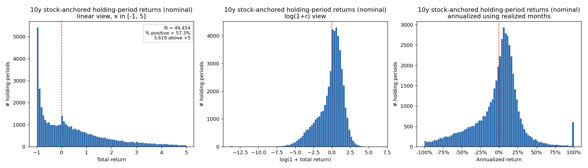
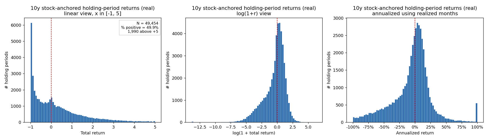
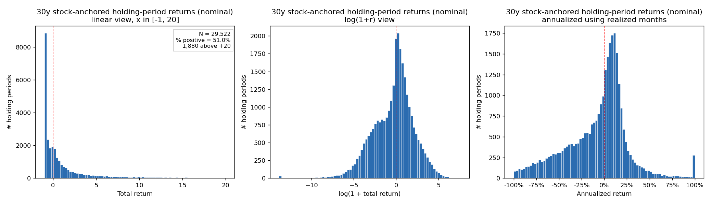
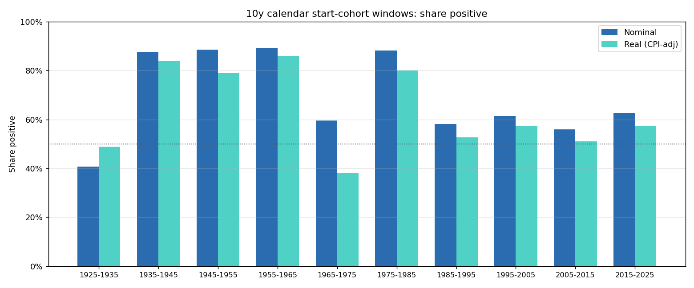
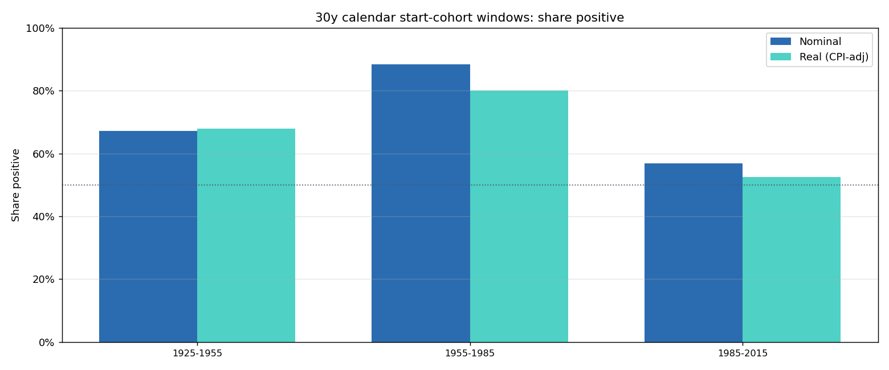
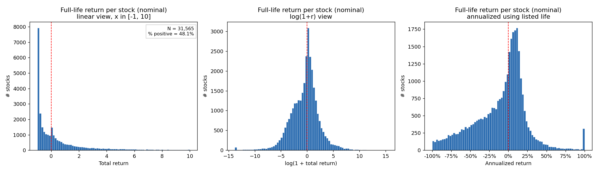
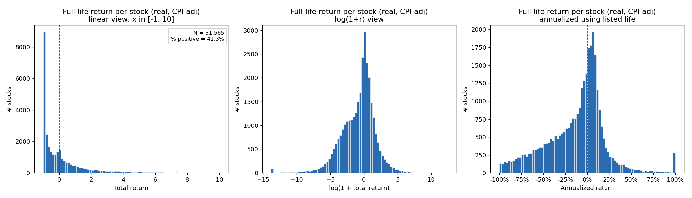

# Long-run return distributions of US-listed stocks

CRSP monthly, 31,565 common-stock PERMNOs, 192512-202512.

## Methodology

The primary view uses stock-anchored, non-overlapping 10-year and 30-year stock-periods. Delisted stocks are retained through their last observed CRSP month; sample-end-censored active periods are audited but excluded from headline summaries.

A second calendar start-cohort view reports fixed windows such as 1925-1935 and 1935-1945. Stocks must exist at the start of a calendar window to enter it. The window represents a buy-at-end-of-start_ymm investor, so the start_ymm month return itself is excluded from compounding (it was earned before the assumed entry). Cohort stocks with only the start_ymm observation (delisted during the start month) are flagged and excluded from headline summaries.

## Data And Universe

- Monthly stock observations after duplicate removal: 4,405,424
- PERMNOs: 31,565
- Universe: US-listed common stocks, excluding REITs, ETFs, closed-end funds, and other non-common-stock securities
- CPI factor: 18.73x (2.95 % annualized)

## Stock-Anchored Results

| Horizon | Basis | Periods | PERMNOs | % positive | Median | Mean multiple | % complete | % delisted | % sparse |
| --- | ---: | ---: | ---: | ---: | ---: | ---: | ---: | ---: | ---: |
| 10y | nominal | 49,454 | 28,950 | 57.3 % | +23.7 % | 2.29x | 47.1 % | 52.9 % | 0.014 % |
| 10y | real (CPI-adj) | 49,454 | 28,950 | 49.9 % | -0.2 % | 1.71x | 47.1 % | 52.9 % | 0.014 % |
| 30y | nominal | 29,522 | 27,420 | 51.0 % | +2.9 % | 6.87x | 10.9 % | 89.1 % | 0.020 % |
| 30y | real (CPI-adj) | 29,522 | 27,420 | 44.0 % | -18.5 % | 2.98x | 10.9 % | 89.1 % | 0.020 % |






### First Period Per Stock

| Horizon | Basis | Stocks | % positive | Median | % complete | % delisted |
| --- | ---: | ---: | ---: | ---: | ---: | ---: |
| 10y | nominal | 28,950 | 48.0 % | -7.0 % | 41.3 % | 58.7 % |
| 10y | real (CPI-adj) | 28,950 | 40.2 % | -27.3 % | 41.3 % | 58.7 % |
| 30y | nominal | 27,420 | 49.1 % | -3.5 % | 10.2 % | 89.8 % |
| 30y | real (CPI-adj) | 27,420 | 41.9 % | -26.7 % | 10.2 % | 89.8 % |

## Calendar Start-Cohort Windows

### 10-Year Windows

| Window | N | % positive nominal | % positive real | Median nominal | Median real | % delisted |
| --- | ---: | ---: | ---: | ---: | ---: | ---: |
| 1925-1935 | 508 | 40.7 % | 48.8 % | -23.9 % | -6.6 % | 22.0 % |
| 1935-1945 | 717 | 87.6 % | 83.8 % | +140.1 % | +83.8 % | 13.1 % |
| 1945-1955 | 851 | 88.6 % | 79.0 % | +165.4 % | +80.2 % | 8.1 % |
| 1955-1965 | 1,048 | 89.2 % | 86.0 % | +153.1 % | +114.7 % | 20.8 % |
| 1965-1975 | 2,157 | 59.6 % | 38.2 % | +17.3 % | -23.9 % | 32.6 % |
| 1975-1985 | 5,053 | 88.1 % | 80.0 % | +297.7 % | +133.9 % | 43.7 % |
| 1985-1995 | 6,227 | 58.1 % | 52.7 % | +26.5 % | +8.2 % | 54.1 % |
| 1995-2005 | 7,767 | 61.4 % | 57.4 % | +39.1 % | +22.5 % | 61.3 % |
| 2005-2015 | 5,787 | 55.9 % | 51.1 % | +13.4 % | +1.3 % | 50.2 % |
| 2015-2025 | 4,797 | 62.7 % | 57.2 % | +40.4 % | +18.6 % | 45.2 % |



### 30-Year Windows

| Window | N | % positive nominal | % positive real | Median nominal | Median real | % delisted |
| --- | ---: | ---: | ---: | ---: | ---: | ---: |
| 1925-1955 | 508 | 67.1 % | 67.9 % | +170.5 % | +126.1 % | 39.6 % |
| 1955-1985 | 1,048 | 88.4 % | 80.0 % | +452.3 % | +160.8 % | 59.0 % |
| 1985-2015 | 6,227 | 56.8 % | 52.4 % | +26.7 % | +7.6 % | 86.8 % |



## Full-Life Results

| Basis | Stocks | % positive | Median | Mean multiple | Max multiple | % sparse |
| --- | ---: | ---: | ---: | ---: | ---: | ---: |
| nominal | 31,565 | 48.1 % | -7.4 % | 295x | 4,421,137x | 0.022 % |
| real (CPI-adj) | 31,565 | 41.3 % | -29.3 % | 20x | 245,578x | 0.022 % |




## Robustness And Audit

### First Observed Return Sensitivity

| Horizon | Basis | % positive incl. | % positive skip | Median incl. | Median skip |
| --- | ---: | ---: | ---: | ---: | ---: |
| 10y | nominal | 57.3 % | 57.5 % | +23.7 % | +23.8 % |
| 10y | real (CPI-adj) | 49.9 % | 50.0 % | -0.2 % | +0.0 % |
| 30y | nominal | 51.0 % | 51.3 % | +2.9 % | +3.4 % |
| 30y | real (CPI-adj) | 44.0 % | 44.2 % | -18.5 % | -18.1 % |
| full-life | nominal | 48.1 % | 48.4 % | -7.4 % | -6.6 % |
| full-life | real (CPI-adj) | 41.3 % | 41.5 % | -29.3 % | -28.8 % |

### Period Audit

| Analysis | Horizon | Started periods | Started PERMNOs | Included periods | Complete | Delisted partial | Sample-end censored | No post-start obs | Sparse |
| --- | ---: | ---: | ---: | ---: | ---: | ---: | ---: | ---: | ---: |
| stock_anchored | 10y | 54,688 | 31,565 | 49,454 | 23,269 | 26,185 | 5,234 | 0 | 7 |
| stock_anchored | 30y | 34,766 | 31,565 | 29,522 | 3,219 | 26,303 | 5,244 | 0 | 7 |
| calendar_window | 10y | 35,167 | 19,495 | 34,912 | 18,303 | 16,864 | 0 | 255 | 6 |
| calendar_window | 30y | 7,856 | 7,119 | 7,783 | 1,558 | 6,298 | 0 | 73 | 3 |

## Caveats

- Stock-anchored headline summaries are stock-period summaries; long-lived stocks can contribute multiple non-overlapping periods.
- The first-period-per-stock table gives a one-stock-one-vote companion view.
- Calendar windows are start-cohort views and do not include stocks that list after the window begins.
- Not-traded months with missing MthRet are set to 0 to preserve the monthly return timeline.
- Sparse histories are rare and listed in sparse_history_audit.csv.
- Delisting outcomes are measured using the CRSP monthly returns present in the file.

## Reproducibility

```bash
python program/run_analysis.py
python program/build_docx.py
```
